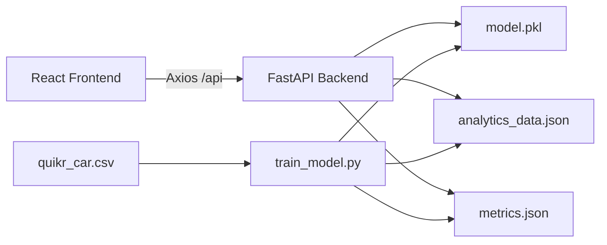

# ValuAuto — Used Car Price Predictor

A full-stack machine learning application that estimates the market value of used cars in India. Built with **React**, **FastAPI**, and **Scikit-Learn**, trained on real Quikr car listing data.

<p align="center">
  
  
  
  
  
</p>

---

## Overview

ValuAuto lets users enter vehicle details — company, model, year, fuel type, and kilometers driven — and receive an instant price estimate powered by machine learning. The platform includes an analytics dashboard, model performance metrics, market insights, PDF report downloads, and prediction history.

### Key Highlights

- Trains and compares **5 regression models**, auto-selects the best performer
- Processes **700+ cleaned records** from the Quikr used-car dataset
- Professional React UI with analytics charts, dark/light mode, and responsive layout
- RESTful FastAPI backend with interactive Swagger docs

---

## Demo

| Frontend | Backend API |
|----------|-------------|
| `http://localhost:5173` | `http://127.0.0.1:8000` |
| Swagger UI → | `http://127.0.0.1:8000/docs` |

---

## Features

### Machine Learning
- Data cleaning pipeline (price parsing, outlier removal, feature extraction)
- Models: Linear Regression, Decision Tree, Random Forest, Gradient Boosting, XGBoost
- Evaluation metrics: MAE, RMSE, R²
- Serialized model (`model.pkl`) for instant inference

### Frontend
- Vehicle valuation form with dynamic company/model dropdowns
- Animated price result with confidence score and market insight
- Analytics dashboard (Recharts): price trends, scatter plots, distributions
- Market insights, prediction history with search/filter
- PDF report download, dark/light theme toggle

### Backend
- FastAPI REST API with CORS support
- Endpoints for prediction, companies, models, metrics, and analytics
- Precomputed analytics JSON for fast dashboard loading

---

## Architecture



---

## Model Performance

| Model | MAE (₹) | RMSE (₹) | R² Score |
|-------|---------|----------|----------|
| **Linear Regression** ✅ | 1,41,351 | 2,84,371 | **0.5225** |
| XGBoost | 1,33,229 | 3,02,039 | 0.4613 |
| Gradient Boosting | 1,41,187 | 3,19,030 | 0.3989 |
| Random Forest | 1,49,461 | 3,26,018 | 0.3723 |
| Decision Tree | 1,71,823 | 3,67,864 | 0.2009 |

> Linear Regression achieved the highest R² on the test split and was selected as the production model.

---

## Tech Stack

| Layer | Technologies |
|-------|-------------|
| **Frontend** | React 18, Vite, Tailwind CSS, Framer Motion, Recharts, Axios, jsPDF |
| **Backend** | Python, FastAPI, Uvicorn, Pydantic |
| **ML** | Scikit-Learn, Pandas, NumPy, XGBoost, Joblib |
| **Data** | Quikr used car listings (`quikr_car.csv`) |

---

## Project Structure

```
carpricepredictor/
├── frontend/
│   ├── src/
│   │   ├── components/     # UI components (Hero, Predictor, Charts, etc.)
│   │   ├── pages/          # Page layouts
│   │   ├── hooks/          # Custom React hooks
│   │   ├── services/       # API client (Axios)
│   │   ├── animations/     # Framer Motion variants
│   │   └── utils/          # PDF report generator
│   ├── package.json
│   └── vite.config.js
├── backend/
│   ├── app.py              # FastAPI entry point
│   ├── routes/             # API route handlers
│   ├── models/             # Pydantic schemas
│   ├── utils/              # Data preprocessing
│   ├── training/           # ML training script
│   ├── data/               # Dataset (quikr_car.csv)
│   ├── model.pkl           # Trained model artifact
│   ├── metrics.json        # Model evaluation results
│   └── requirements.txt
└── README.md
```

---

## Getting Started

### Prerequisites

- Python **3.10+**
- Node.js **18+**
- npm

### 1. Clone the repository

```bash
git clone https://github.com/YOUR_USERNAME/car-price-predictor.git
cd car-price-predictor
```

### 2. Backend setup

```bash
cd backend

# Create and activate virtual environment
python -m venv venv

# Windows
venv\Scripts\activate

# macOS / Linux
source venv/bin/activate

# Install dependencies
pip install -r requirements.txt

# Train the model (skip if model.pkl already exists)
python training/train_model.py

# Start the API server
uvicorn app:app --reload --host 127.0.0.1 --port 8000
```

### 3. Frontend setup

Open a **new terminal**:

```bash
cd frontend
npm install
npm run dev
```

Open **http://localhost:5173** in your browser.

---

## API Reference

| Method | Endpoint | Description |
|--------|----------|-------------|
| `GET` | `/health` | Health check and model status |
| `GET` | `/companies` | List all car manufacturers |
| `GET` | `/models?company=Hyundai` | Models for a given company |
| `POST` | `/predict` | Predict car price |
| `GET` | `/metrics` | ML model performance metrics |
| `GET` | `/analytics` | Dashboard analytics data |

### Example: Predict Price

**Request**

```bash
curl -X POST http://127.0.0.1:8000/predict \
  -H "Content-Type: application/json" \
  -d '{
    "company": "Hyundai",
    "model": "i20 Sportz 1.2",
    "fuel_type": "Petrol",
    "year": 2018,
    "kms_driven": 35000
  }'
```

**Response**

```json
{
  "predicted_price": 251108.66,
  "formatted_price": "₹ 2,51,109",
  "confidence_score": 75.0,
  "insight": "This vehicle is priced lower than 91% of similar cars.",
  "model_used": "Linear Regression"
}
```

---

## ML Pipeline

The training script (`backend/training/train_model.py`) runs the following steps:

1. Load `quikr_car.csv`
2. Remove rows with "Ask For Price"
3. Parse and clean price and kilometer values
4. Handle missing values and remove duplicates
5. Remove statistical outliers (IQR method)
6. Extract company and model features from car names
7. Train 5 regression models on an 80/20 split
8. Compare MAE, RMSE, and R² — select the best model
9. Save `model.pkl`, `metrics.json`, and `analytics_data.json`

**Features used:** Company, Model, Fuel Type, Year, KM Driven  
**Target variable:** Price (INR)

---

## Environment Variables

The frontend proxies API requests to the backend via Vite. Optional override:

```env
# frontend/.env
VITE_API_URL=http://127.0.0.1:8000
```

By default, the dev server proxies `/api/*` → `http://127.0.0.1:8000` (see `frontend/vite.config.js`).

---

## Screenshots

> Add screenshots of the landing page, predictor, and analytics dashboard here after deploying or running locally.

---

## Future Improvements

- [ ] Deploy frontend (Vercel) and backend (Railway/Render)
- [ ] Add user authentication and cloud-saved history
- [ ] Hyperparameter tuning with GridSearchCV
- [ ] Docker Compose for one-command setup
- [ ] CI/CD pipeline with automated model retraining

---

## License

This project is open source under the [MIT License](LICENSE).

---

## Author

Built as a portfolio project showcasing full-stack development and machine learning skills.

If you find this useful, consider giving it a ⭐ on GitHub!
